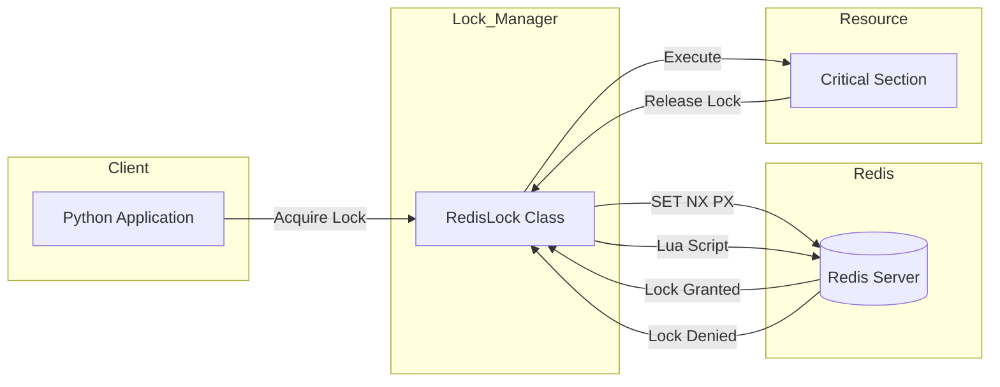

```mermaid
flowchart LR

subgraph Client
    A[Python Application]
end

subgraph Lock_Manager
    B[RedisLock Class]
end

subgraph Redis
    C[(Redis Server)]
end

subgraph Resource
    D[Critical Section]
end

A -->|Acquire Lock| B
B -->|SET NX PX| C

C -->|Lock Granted| B
C -->|Lock Denied| B

B -->|Execute| D

D -->|Release Lock| B

B -->|Lua Script| C
```