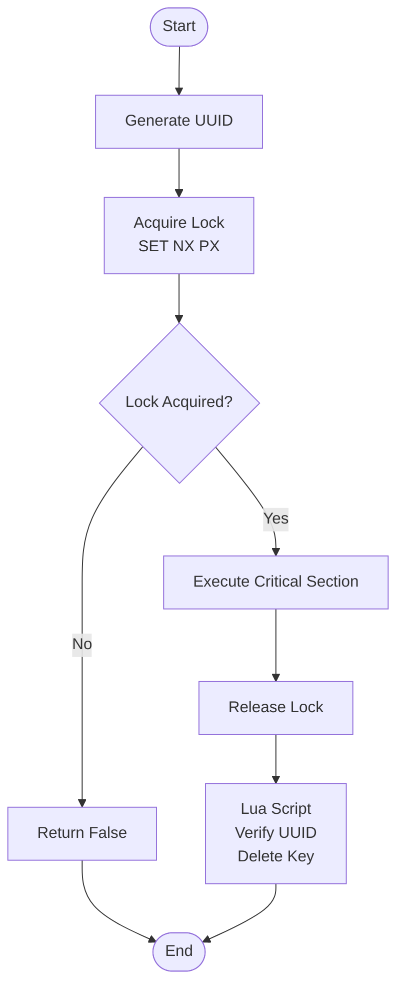

```mermaid
flowchart TD

Start([Start])

Create[Generate UUID]

Acquire[Acquire Lock<br>SET NX PX]

Decision{Lock Acquired?}

Retry[Return False]

Critical[Execute Critical Section]

Release[Release Lock]

Lua[Lua Script<br>Verify UUID<br>Delete Key]

End([End])

Start --> Create
Create --> Acquire
Acquire --> Decision

Decision -- No --> Retry
Retry --> End

Decision -- Yes --> Critical
Critical --> Release
Release --> Lua
Lua --> End
```