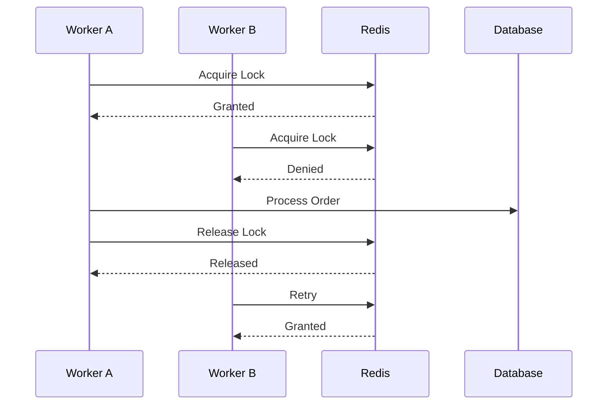

```mermaid
sequenceDiagram

participant Worker A
participant Worker B
participant Redis
participant Database

Worker A->>Redis: Acquire Lock
Redis-->>Worker A: Granted

Worker B->>Redis: Acquire Lock
Redis-->>Worker B: Denied

Worker A->>Database: Process Order

Worker A->>Redis: Release Lock
Redis-->>Worker A: Released

Worker B->>Redis: Retry
Redis-->>Worker B: Granted
```