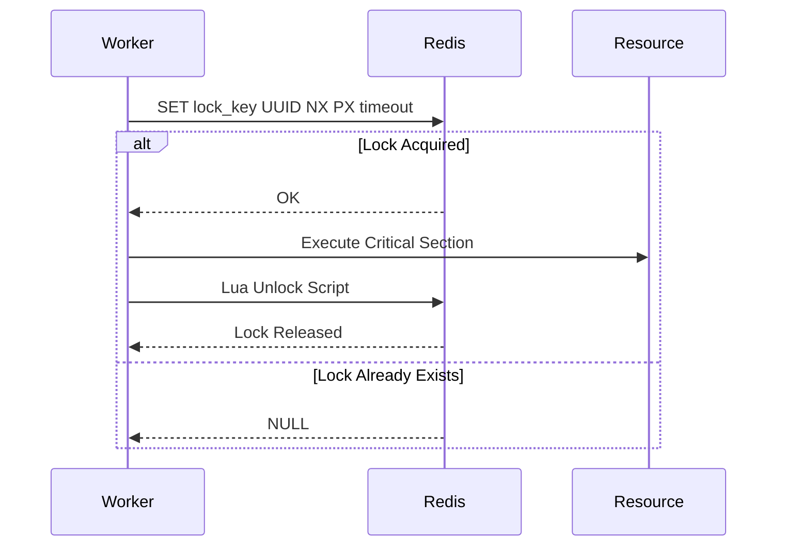

```mermaid
sequenceDiagram

participant Worker
participant Redis
participant Resource

Worker->>Redis: SET lock_key UUID NX PX timeout

alt Lock Acquired

Redis-->>Worker: OK

Worker->>Resource: Execute Critical Section

Worker->>Redis: Lua Unlock Script

Redis-->>Worker: Lock Released

else Lock Already Exists

Redis-->>Worker: NULL

end
```